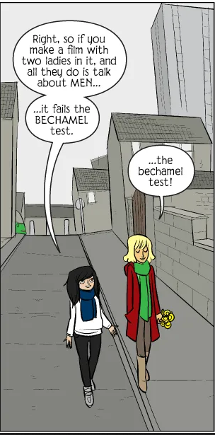

<h1 align="center">The Bechdel Test</h1>

The Bechdel Test is a litmus test for female presence in fictional media. The test is named for Alison Bechdel, creator of the comic strip Dykes to Watch Out For, who made it known to the world with this strip.

In order to pass, the film or show must meet the following criteria:

    It includes at least two women,note 
    who have at least one conversation,note 
    about something other than a man or men.

### Links about the Bechdel test

<a href="https://en.wikipedia.org/wiki/Bechdel_test">wikipedia: The Bechdel Test</a> 
<a href="https://tvtropes.org/pmwiki/pmwiki.php/UsefulNotes/TheBechdelTest">TV Tropes Wiki: The Bechdel Test</a>

